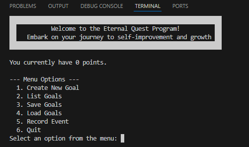

# 🎮 Eternal Quest Program

📚 Project for **CSE 210: Programming with Classes – Week 06**  
🎓 BYU-Idaho | BSc in Software Development  

---

## 🌟 About the Project

The **Eternal Quest Program** is a **console-based goal tracker** that turns self-improvement into an engaging game. Inspired by RPG-style progression, this application awards points as users complete various types of goals—helping turn habits and tasks into achievements.

---

## ✨ Features

- 🧩 **Diverse Goal Types**
  - **Simple Goals** – One-time tasks you check off
  - **Eternal Goals** – Habits that continuously earn points
  - **Checklist Goals** – Multi-step objectives with a bonus on full completion

- 🎯 **Dynamic Point System**
  - Earn points with every accomplishment
  - Stay motivated with visible progress

- 📊 **Clear Progress Tracking**
  - See what’s done at a glance (`[X]`)
  - View detailed progress (e.g., `Completed 3/5 times`)

- 🧠 **Intuitive Goal Management**
  - Create, list, update, and record achievements with ease
  - Track your total score

- 💾 **Secure Data Persistence**
  - Save your goals and score to a file
  - Load progress any time and pick up where you left off

---

## 🚀 How to Use

Run the program via your console and interact with the intuitive menu:

1. **Create New Goal** – Choose a goal type to begin your quest  
2. **List Goals** – See all goals and progress status  
3. **Save Goals** – Save your current progress to a file  
4. **Load Goals** – Load previous data to continue your journey  
5. **Record Event** – Mark a goal as achieved and earn points  
6. **Quit** – Exit the application

---

## 🛠️ Built With

- **C#** – Fast, modern, and powerful
- **Object-Oriented Programming (OOP)** – Emphasizing:
  - Inheritance  
  - Polymorphism  
  - Encapsulation
- **File I/O** – Using `System.IO` for file saving/loading

---

## 📸 Preview - Menu

---

## 👨‍💻 Author

**Tiago Borges**  
Finance pro turned future fullstack developer 🚀  
Feel free to explore, contribute, or adapt it for your own **Program Quest**!

---

---

> 🧭 *“The journey of a thousand lines begins with a single "Hello World”*

Let me know if you'd like:
- 📸 Screenshot generation of the console output
- 🖼 A custom logo/banner
- 🧪 Unit tests to include in the repo
- 🌐 Multi-language version 